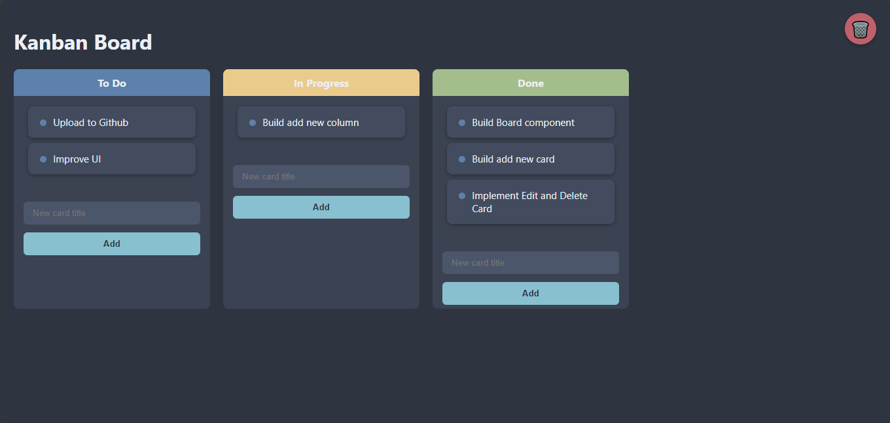

# 📝 Kanban Board (React + Vite)

A sleek, Nord-themed Kanban board built with React and Vite, styled using CSS. Features drag-and-drop card organization, inline editing, and a trash bin for card deletion via drag.

 <!-- Replace with your image path -->

---

## 🔧 Features

- 🧩 Columns: "To Do", "In Progress", and "Done"
- ➕ Add new cards to any column
- ✏️ Double-click to **edit** card titles inline
- 🗑️ Drag cards over the **trash bin** to delete them
- 🎨 Modern dark UI using **Nord color palette**
- 📦 Built with **React + Vite**

---


## 📁 Project Structure

```

📦kanban-board
┣ 📁src
┃ ┣ 📁components
┃ ┃ ┣ 📄Column.jsx
┃ ┃ ┗ 📄Card.jsx
┃ ┣ 📄App.jsx
┃ ┗ 📄main.jsx
┣ 📄index.html
┣ 📄App.css
┗ 📄vite.config.js

````

---

## 🚀 Getting Started

### 1. Clone the repository
```bash
git clone https://github.com/yourusername/kanban-board.git
cd kanban-board
````

### 2. Install dependencies

```bash
npm install
```

### 3. Run the app

```bash
npm run dev
```

> Your app will be running at `http://localhost:5173`

---

## 📦 Build for Production

```bash
npm run build
```

---

## 🎨 Nord Color Theme Reference

| Purpose       | Variable   | Hex     |
| ------------- | ---------- | ------- |
| Background    | `--nord0`  | #2E3440 |
| Card          | `--nord2`  | #434C5E |
| Text Light    | `--nord6`  | #ECEFF4 |
| Blue Accent   | `--nord10` | #5E81AC |
| Green Column  | `--nord14` | #A3BE8C |
| Yellow Column | `--nord13` | #EBCB8B |

---

## 📌 Future Plans

* 🧭 Add card drag-to-reorder within columns
* 💾 Persist board state with localStorage or a backend
* 🖥 Package as a desktop app using **Tauri** or **Electron**
* ✅ Add swimlanes and WIP limits

---

## 📃 License

This project is licensed under the [MIT License](./LICENSE).

---

## 👨‍💻 Author

Built with ❤️ by [Your Name](https://github.com/yourusername)

```

---

Would you like me to generate a live preview GIF and a proper screenshot for GitHub too?
```
